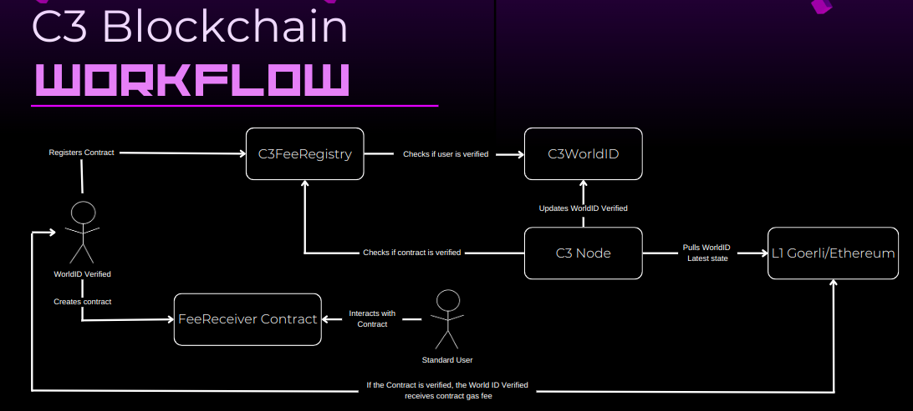

# c3-blockchain

Welcome to **c3-blockchain** - A new blockchain model designed for the ethglobal hackathon! Powering the future with a blend of the **op-stack** by Optimism and the uniqueness verification of Worldcoin. **c3-blockchain** reimagines fee distribution by awarding 50% of gas fees to smart contract creators. What's the catch? It's exclusive for those who are verified by Worldcoin, ensuring genuine participants reap the rewards.

## 🌍 Features

-  **Fee Distribution**: Smart contract creators earn 50% of the gas fees.
-  **Human Verification**: Integration with Worldcoin to ensure only verified humans benefit.
-  **L2 Advantage**: Efficiently fetches the Worldcoin state from the L1 and operates it on the L2.
-  **Smart Contract Registry**: Register your contract and start earning from the fees!

## Design



## 🚀 Getting Started

To kick-start your **c3-blockchain** journey locally, follow these steps:

1. **Clone the Repository**

```

git clone https://github.com/your-github-username/c3-blockchain.git

```

2. **Navigate to the Project Directory**

```

cd c3-blockchain

```

3. Follow the instructions to run op-geth only

https://stack.optimism.io/docs/build/getting-started/

4. **Run the op-geth**

```

cd op-geth && op-geth ./genesis.sh && op-geth ./start.sh

```

5. **Deploy de Worldcoin L2 Bridge**

```

cd world-id-state-bridge
pnpm install
forge script src/script/deploy/DeployOpWorldID.s.sol:DeployOpWorldID --private-key $PRIVATE_KEY --broadcast --rpc-url http://127.0.0.1:8545/

```

The command wont stop running because you will need to start the next step to see it running completely

6. **Start the op-node and batcher according to the op-docs**
   To see the whole flow is recommended to pick a block close to the last update to the WorldID in goerli. This is because the process of fetching logs and updating the local state takes a while.

   https://stack.optimism.io/docs/build/getting-started/
   On each folder (op-node and op-batcher) there is a start.sh that follows the op-stack docs.

7. **Stop the op-node and batcher and deploy the registry**
   You'll grab the world id bridge and put it in the node bridge hardcoded :). Youll deploy the registry in the "contracts" folder and do the same with its address, but this time youll go to op-geth and hardcode it there. Dont forget to give the registry the address of the worldcoin contract.

```

cd contracts
pnpm install
npx hardhat run scripts/deployRegistry.ts --network geth

```

8. **Run everything :)**
   Compile and run the op-geth and op-node. Use make geth and make op-node on their folders. Then follow the same instructions in the op-stack docs or just run ./start.sh on each one.

9. **Run the app client**
   This is just a frontend app to show the contract deployment and fees. Also the worldcoin authentication, you can run it just like a normal Nextjs app with yarn dev. Dont forget to connect metamask to the local network.

## 💡 Modifications to the op-stack

We've made some significant changes to the original **op-stack** to suit our vision. You can review our modifications at these links:

-  [EVM Fee changes](https://github.com/Rcontre360/c3-blockchain/blob/optimism/op-geth/core/state_transition.go#L524-L534)
-  [EVM Worldcoin/Registry Fee validation](https://github.com/Rcontre360/c3-blockchain/blob/optimism/op-geth/core/state_transition.go#L378-L408)
-  [Worldcoin Update transactions](https://github.com/Rcontre360/optimism/blob/3d67fc091b517f4f2d034e89ad5fb79e86f537f9/op-node/rollup/derive/attributes.go#L83-L86)
-  [Worldcoin tx builder and event unmarshall](https://github.com/Rcontre360/optimism/blob/3d67fc091b517f4f2d034e89ad5fb79e86f537f9/op-node/rollup/derive/worldcoin_info.go)

## 💡 Usage of Worldcoin

We've used many things comming from the worldcoin stack

-  [Frontend Integration](https://github.com/Rcontre360/c3-blockchain/blob/optimism/client/src/components/app/contracts/myContractsTable.tsx#L72)
-  [Local WorldID Contract](https://github.com/Rcontre360/world-id-state-bridge/blob/93c1c871db8bfbbf5d7845532a3caaf9d478d04f/src/script/deploy.js#L571-L595)
-  [Worldcoin tx builder and event unmarshall](https://github.com/Rcontre360/optimism/blob/3d67fc091b517f4f2d034e89ad5fb79e86f537f9/op-node/rollup/derive/worldcoin_info.go)
-  [Worldcoin verifier as Registry](https://github.com/Rcontre360/c3-blockchain/blob/optimism/contracts/contracts/C3RewardsRegistry.sol)

## 🔗 Useful Links

-  [Optimism's op-stack](https://github.com/ethereum-optimism/optimism)
-  [Worldcoin's official website](https://www.worldcoin.global/)

## 🙌 Contributing

Feel free to submit issues and enhancement requests.

## 📜 License

[MIT](LICENSE)

---

Crafted with ❤️ for ethglobal hackathon.
